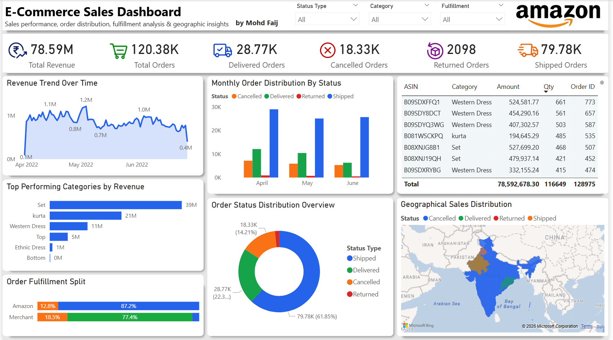
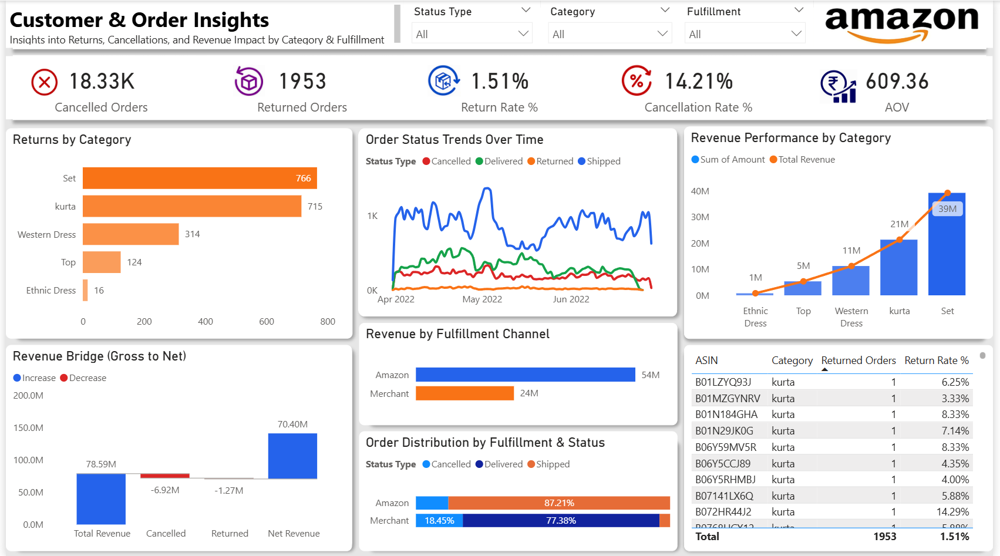
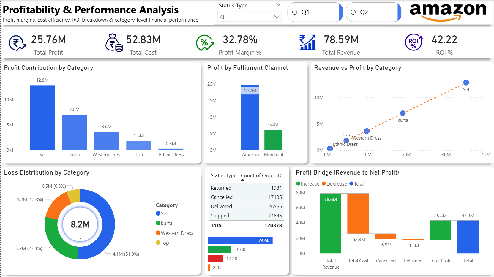
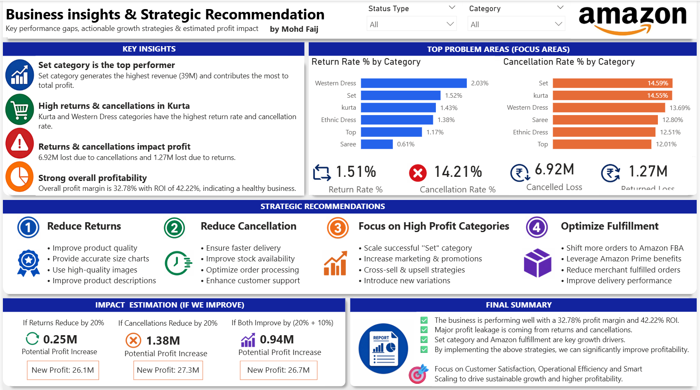

<div align="center">


# 📊 Amazon E-Commerce Sales Analytics Dashboard

### A Full-Scale Business Intelligence System Built in Power BI

[](https://powerbi.microsoft.com/)
[](#)
[](#)
[](#)

<br/>

🌐 **[Portfolio](https://mohdfaij-data.github.io/)** &nbsp;|&nbsp; 📊 **[Live Dashboard](YOUR_LIVE_DASHBOARD_LINK)** &nbsp;|&nbsp; 💻 **[GitHub](https://github.com/mohdfaij-data)**

<br/>

> *"Most dashboards tell you what happened. This one tells you what to do next."*

</div>

---

## 🧭 Project Overview

This is not a simple chart report. This is a **4-page end-to-end business intelligence system** built on real Amazon India sales data, covering **120,378 orders** and **₹78.59M in revenue** across April–June 2022.

The goal was to go beyond visualization — to build something that a business team could actually use to make decisions, cut losses, and scale profits.

| Metric | Value |
|--------|-------|
| 💰 Total Revenue | ₹78.59M |
| 📦 Total Orders | 1,20,378 |
| 📈 Profit Margin | 32.78% |
| 📊 ROI | 42.22% |
| ✅ Delivered Orders | 28,770 |
| ❌ Cancelled Orders | 18,330 |
| 🔄 Returned Orders | 1,953 |
| 💸 Loss from Cancellations | ₹6.92M |

---

## 📁 Dashboard Pages

---

### 📄 Page 1 — E-Commerce Sales Overview
> *Comprehensive view of sales performance, order distribution, fulfillment analysis & geographic insights*



**What this page covers:**
- 📈 Sales trend over time (April–June 2022) — peaks up to ₹1.2M/month
- 🏆 Top performing categories by revenue — **Set (₹39M), Kurta (₹21M), Western Dress (₹11M)**
- 📦 Monthly order distribution by status (Cancelled vs Delivered)
- 🗺️ Geographic sales distribution map across India
- 🔝 Top ASINs by revenue — B08XNJG8B1 leads at ₹5.27L across 507 orders
- 🚚 Fulfillment split: **Amazon (87.2%)** vs Merchant (77.4% delivery rate)

**Key Insight:** Shipped orders dominate at 61.85% of total — a large pipeline of potential delivered revenue still in transit.

---

### 📄 Page 2 — Customer & Order Insights
> *Deep dive into return behavior, cancellation trends, and revenue impact by category & fulfillment*



**What this page covers:**
- ❌ **18,330 cancelled orders** — the single biggest profit threat
- 🔄 **1,953 returned orders** | **1.51% return rate** | **14.21% cancellation rate**
- 💳 Average Order Value: **₹609.36**
- 📊 Category-level return analysis — **Set (766)** and **Kurta (715)** are top return categories
- 📉 Revenue waterfall: Total ₹78.59M → Net ₹70.40M after cancellations & returns
- 🚚 Revenue by fulfillment: **Amazon ₹54M** vs **Merchant ₹24M**
- 🔬 Product-level return rate table (ASIN-level granularity with return %)

**Key Insight:** ₹6.92M lost to cancellations + ₹1.27M to returns = **₹8.19M recoverable profit** sitting on the table.

---

### 📄 Page 3 — Profitability & Performance Analysis
> *Profit margins, cost efficiency, ROI breakdown & category-level financial performance*



**What this page covers:**
- 💰 **₹25.76M** total profit | **₹52.83M** total cost
- 📈 **32.78% profit margin** | **42.22% ROI**
- 🏆 Profit by category: **Set ₹12.8M**, Kurta ₹7.0M, Western Dress ₹3.6M
- 🚚 Amazon fulfillment profit: **₹19.7M** vs Merchant: **₹6.0M** (3x difference)
- 🍩 Total loss by category (donut): Set 51%, Kurta 27.4%, Western Dress 15.3%
- 📉 Waterfall chart: Revenue → Cost → Cancellations → Returns → Net Profit
- 🔢 Order status breakdown: 74.6K shipped, 26.6K delivered, 17.2K cancelled

**Key Insight:** The business is fundamentally healthy. The profit leak is operational — not structural. Fix fulfillment and cancellations, and margins climb significantly.

---

### 📄 Page 4 — Business Insights & Strategic Recommendations
> *Key performance gaps, actionable growth strategies & estimated profit impact*



**What this page covers:**
- 🔍 4 key business insights with visual indicators
- 🎯 Top problem areas: Return Rate % and Cancellation Rate % by category
- 🧠 4 strategic recommendations with specific action items
- 💡 Impact estimation — projected profit recovery for each scenario

**Strategic Recommendations:**

| # | Strategy | Key Actions | Projected Impact |
|---|----------|-------------|-----------------|
| 1️⃣ | Reduce Returns | Better images, accurate size charts, improved descriptions | +₹0.25M |
| 2️⃣ | Reduce Cancellations | Faster delivery, stock availability, better support | +₹1.38M |
| 3️⃣ | Scale High-Profit Categories | Double down on Set, cross-sell, new variations | Revenue growth |
| 4️⃣ | Optimize Fulfillment | Shift to Amazon FBA, leverage Prime, reduce merchant orders | Margin growth |

**Impact Estimation:**

| Scenario | Profit Gain | New Total Profit |
|----------|-------------|-----------------|
| Returns reduce by 20% | +₹0.25M | ₹26.1M |
| Cancellations reduce by 20% | +₹1.38M | ₹27.3M |
| Both improve (20% + 10%) | +₹0.94M | ₹26.7M |

**Key Insight:** Reducing cancellations by just 20% is the single highest-ROI action available — ₹1.38M recovered with process improvements alone.

---

## 🛠️ Tools & Technologies

| Tool | Purpose |
|------|---------|
| **Power BI Desktop** | Dashboard design, report pages, slicers & interactivity |
| **DAX** | Custom measures — profit margin, ROI, return rate, cancellation rate, loss calc |
| **Power Query (M)** | Data cleaning, transformation, and shaping |
| **Data Modeling** | Relationships between order, product, category & date tables |
| **Business Analysis** | KPI identification, insight generation, strategic recommendations |

---

## 📐 Key DAX Measures

```dax
-- Profit Margin %
Profit Margin % = DIVIDE([Total Profit], [Total Revenue], 0) * 100

-- ROI %
ROI % = DIVIDE([Total Profit], [Total Cost], 0) * 100

-- Return Rate %
Return Rate % = DIVIDE([Returned Orders], [Total Orders], 0) * 100

-- Cancellation Rate %
Cancellation Rate % = DIVIDE([Cancelled Orders], [Total Orders], 0) * 100

-- Cancelled Loss
Cancelled Loss = 
CALCULATE(
    SUM(Orders[Amount]),
    Orders[Status] = "Cancelled"
)

-- Returned Loss
Returned Loss = 
CALCULATE(
    SUM(Orders[Amount]),
    Orders[Status] = "Returned"
)

-- Net Revenue
Net Revenue = [Total Revenue] - [Cancelled Loss] - [Returned Loss]

-- AOV (Average Order Value)
AOV = DIVIDE([Total Revenue], [Total Delivered Orders], 0)
```

---

## 📂 Project Structure

```
📁 amazon-sales-dashboard/
│
├── 📊 Amazon_Sales_Dashboard.pbix      ← Main Power BI file
├── 📄 README.md                        ← Project documentation
│
├── 📁 data/
│   └── 📋 amazon_sales_data.csv        ← Raw dataset
│
└── 📁 screenshots/
    ├── 🖼️ page1_sales_overview.png
    ├── 🖼️ page2_customer_insights.png
    ├── 🖼️ page3_profitability.png
    └── 🖼️ page4_recommendations.png
```

---

## 💡 Final Summary

> The business is performing well — **32.78% profit margin** and **42.22% ROI** are strong fundamentals.
> The primary opportunity is **operational**: cancellations (₹6.92M loss) and returns (₹1.27M loss) are recoverable with targeted fixes.
> The **Set category** and **Amazon fulfillment** are the two strongest growth levers — scaling both simultaneously drives compounding profit growth.
> By implementing the 4 strategic recommendations, the business can realistically recover **₹1.38M–₹2M+** in annual profit without acquiring a single new customer.

---

## 👤 About the Author

<div align="center">

**Mohd Faij**
*Data Analyst | Power BI Developer | Business Intelligence*

[](https://mohdfaij-data.github.io)
[](www.linkedin.com/in/mohdfaij-data)
[](https://github.com/mohdfaij-data)

</div>

---

<div align="center">

⭐ **If this project helped you or impressed you, please give it a star!** ⭐

*Built with Power BI · Data period: April–June 2022 · Market: Amazon India*

</div>
